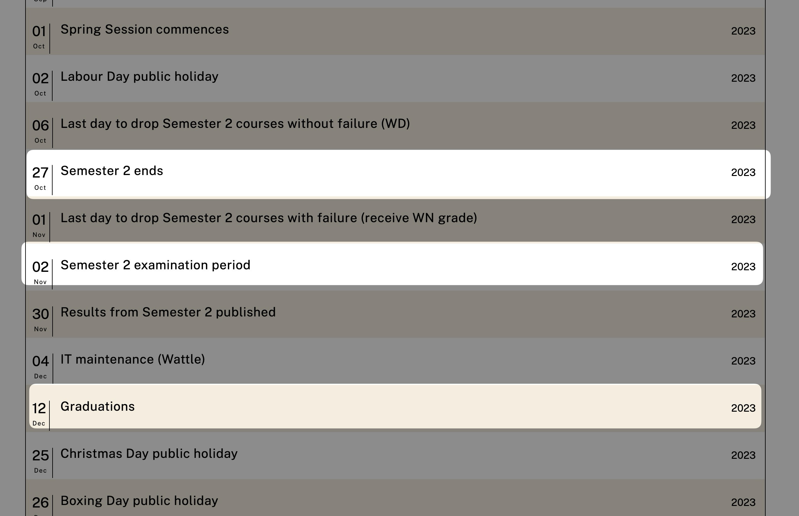

## Caution

This post should not be your reference material or proof for "why I can work right now" to your boss, it is solely for the purpose of tracking some material on the internet. And this post was written on date: "2023-11-23", policies and definitions quoted in this post may change as time go on.

## Working Restriction

According to "4.7.3.2. Condition 8104/8105 – Limited work (students and family members)" the following condition must be met in the period of stay for student visa holder subclass 500:
> - Conditions 8104 is mandatory for all student visas granted to secondary applicants.
> - Conditions 8105 is mandatory for all student visas granted to primary applicants.
You might consider having a look at condition 8104 if you happen to be accompany parents of the student, but other than that we will mainly focus o on the working restriction 8105.

According to Department of Home Affairs: ([Screenshot from the PDF](2023.11.23%20-%20082220.jpg))

> - Condition 8105 restricts students to 40 hours work per fortnight while their course is in session. They are not permitted to work until their course has commenced. When their course is not in session they may work unlimited hours. Students who have commenced a masters by research or a doctorate course may work unlimited hours after commencing their postgraduate research course.

And in the pdf I have attached below, they also have detailed definition for the terms mentioned in the above statement: ([Screenshot from the PDF](2023.11.23%20-%20081849-0687975.jpg))

> Defining 'in session' and "out of session"
> A course is considered to be 'in session':
> -   For the duration of the advertised semesters (including periods when exams are being held);
> -   If a student is undertaking another course during a break from their main course and the points will be credited towards their main course. A course is considered to be ‘out of session':
>
> -   During scheduled course breaks
> -   If the course has been deferred or suspended in line with Standard 9 of the National Code of Practice for Providers of Education and Training to Overseas Students
> -   If a student has completed their course as scheduled (as per dates listed on their CoE) and still holds a valid Student visa
> -   If a student’s enrolment has been cancelled due to the default of their education provider, until they secure alternative enrolment and commence the course.

Hence you can refer the dates from your university calendar, for instance, mine at [ANU University Calendar](https://www.anu.edu.au/directories/university-calendar?year=2023); And find the key dates such as: "Semester XX Ends", "Examination Period Ends", "Grade Release", "Graduate" in the calendar; Then, most preferably, grab the latest date among those dates that are relevant to you, and from that day on you can work in full time, no restriction, ≥48 hours/14 days, until either your current visa get expired, or the course start to become "in session" again.

Example for my situation:

For my situation, my safest choice to start on full time is after the graduation date, that is "12 Decenter 2023" (or if one would take a bit of risk, he/she may also try "02 November 2023" or "30 November 2023" where the exam ends and grade releases)

## Reference
- [Department of Home Affairs - Student Visa (Subclass 500) - Details](https://immi.homeaffairs.gov.au/visas/getting-a-visa/-visa-listing/student-500)
- [Department of Home Affairs - Student Visa (Subclass 500) - Restrictions](https://immi.homeaffairs.gov.au/visas/already-have-a-visa/check-visa-details-and-conditions/see-your-visa-conditions?product=500#)
- [Department of Home Affairs - PAM3: Visa 500 - Student](https://www.homeaffairs.gov.au/foi/files/2020/fa-190900112-r1-document-1-released.PDF)

