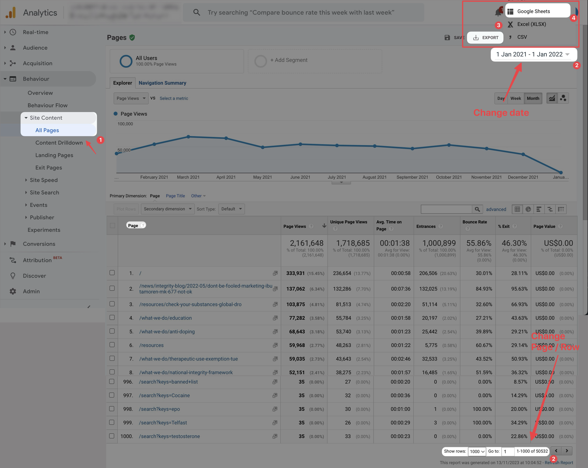

In this tutorial I will guide you through how to export google analytics data **manually** on the Google Analytics page

## Step-1: open panel exporting from
First, proceed to the page you would like to export. For instance in thise example I want to export the **"all page's views and performances"**, (located at "behavior \> site content \> all pages").

## Step-2: narrow down the records
Second, you will need to narrow down the number of records you would like to export via selecting a desired "**date range**" and "**row, page**". The export will only happen on the data that is currently getting displayed, if you want to export more data, you'll either have to change the date, or the number or rows and pages. Depending on the quantity of your data, you might need to narrow it down for the sake of processing efficiency, otherwise the web application might get stuck.

## Step-3: perform the export(s)
Lastly, simply click on the export and select the corresponding export option (here I'll use "Google Excel") which will export the data of your desired range (here I am exporting "The first 1-1000 record between date: "1 Jan 2020 - 1 Nov 2023"). **In order to export a complete list of all data gathered, you might want to repeat the above procees for multiple times !** (e.g. 1-1000 then 2000-3000, ..., 49000-50000)

---
**Reference**
- [How to backup Universal Analytics: Exporting data from Google Analytics and moving to GA4](https://youtu.be/WGIe_HgIdBg?si=8Z6IWZ-XEMi0_nKY)
- [[UA] Export and share reports](https://support.google.com/analytics/answer/1038573?hl=en)
