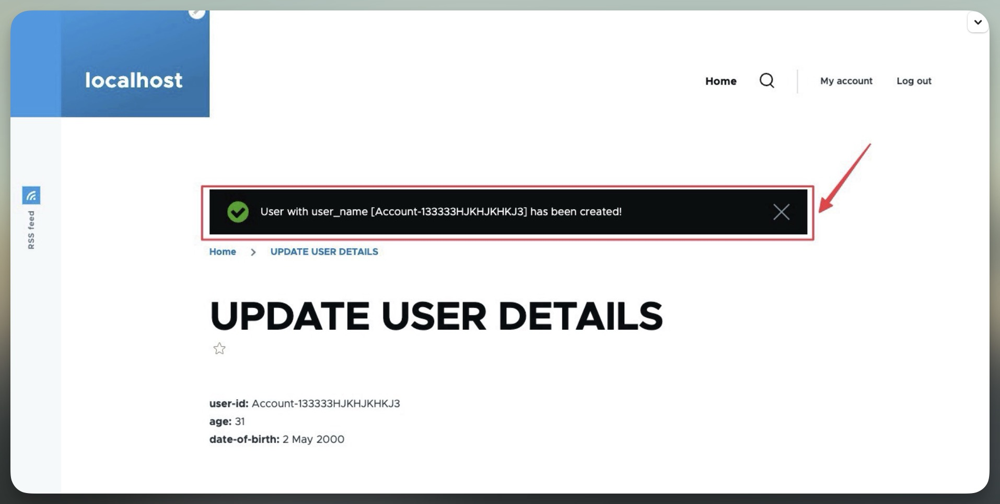

## Step-1: Get instance of messenger service

**Method 1**

Standard way to get messenger service, in case you want to pass it using dependency injection.

`$messenger = \Drupal::service("messenger");`

**Method 2**

Fast way to use helper function.

`$messenger = \Drupal::messenger();`

Also in the form object or controller we don't have include it using dependency injection. We can us directly

`$messenger = $this->messenger();`

## Step-2: Adding info/warn/error message

Add message. Allows to send a message of any type, the second parameter accepts the type: `$meesenger->addMessage(t('Your message.'), MessengerInterface::TYPE_WARNING);`; But in most of the cases it is better to use directly specific method:

-   Add Status Message: `$messenger->addStatus(t('Your message'));`
-   Add Warning/Debug: `$messenger->addWarning(t('Your message'));`
-   Add Error Message: `$messenger->addError(t('Your message'));`

## Step-3: Check the final outcome

## Reference
- http://lobsterr.me/post/how-show-message-drupal-9
- https://www.drupal.org/docs/drupal-apis/javascript-api/messages-api
