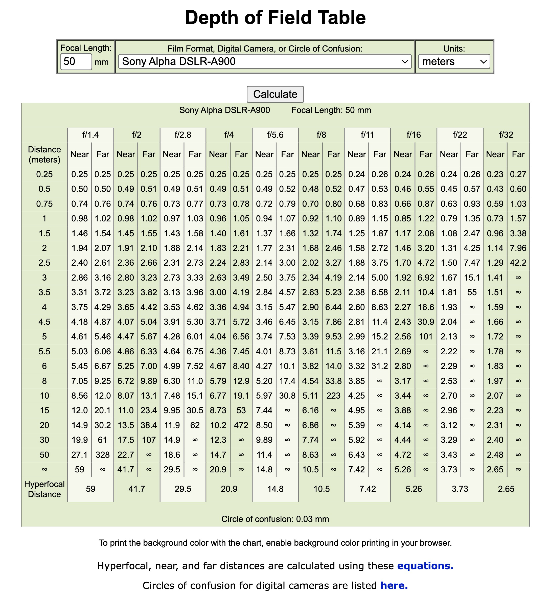
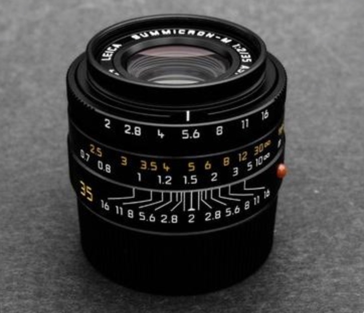
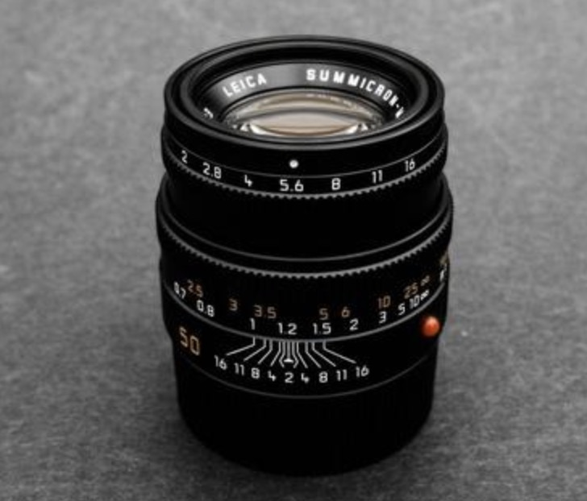
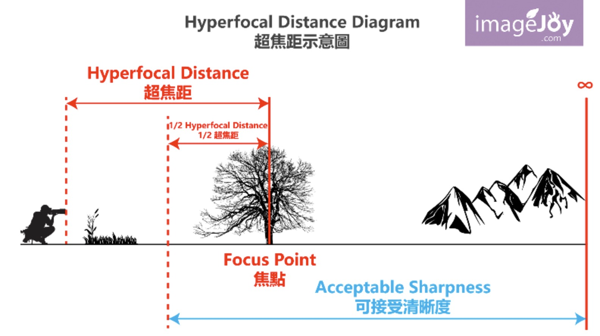
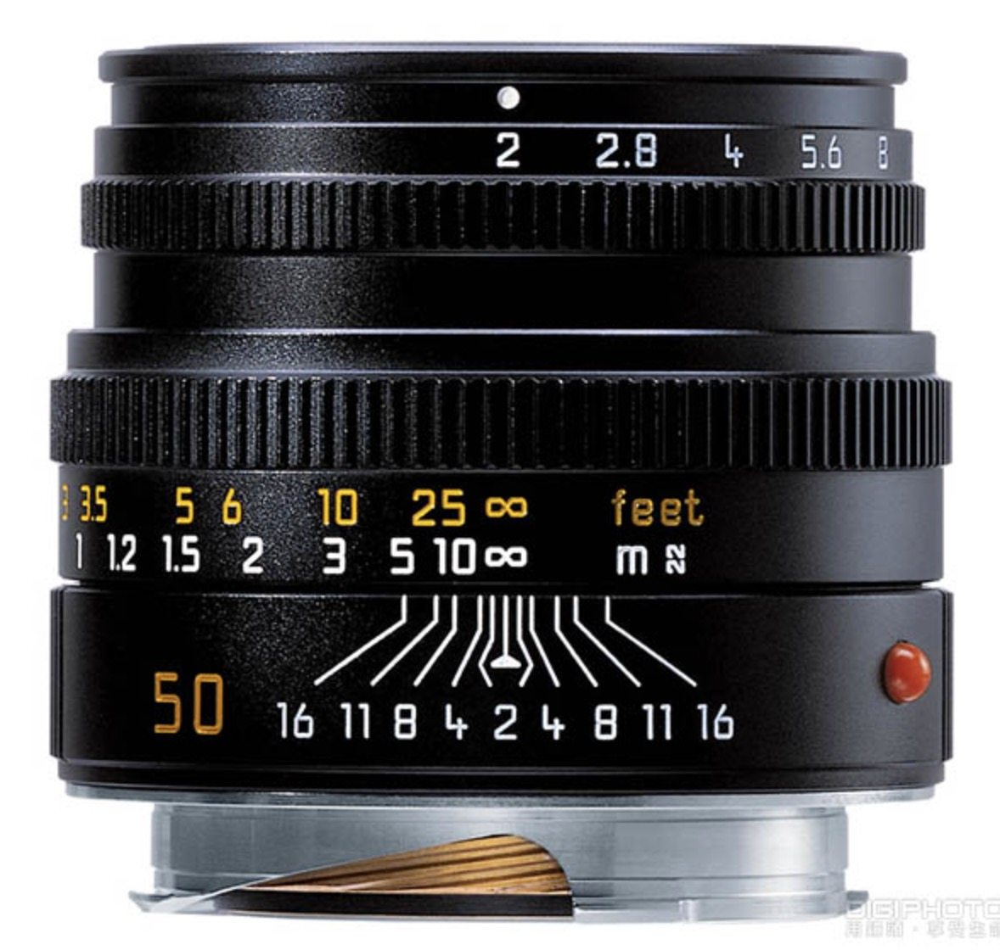

## Why using Pan-Focus

Use as intro: 

>   说到这里我就举例说了一个比较特别的例子，叫做“不能对焦的泛焦机”，它也是不能手动对焦的，但只不过它并不是“不能自动对焦”而是“不能对焦”。那不能对焦的相机到底怎么拍照呢？其实泛焦机它指的就是景深特别大的那些相机，景深已经大到了“超焦距”，已经不用再对焦的那些相机。
>
>   比如说我们能花几十块钱去买一台傻瓜机，那机器什么功能都没有，你不能对焦，但它会在说明书上告诉你说，你拍照必须在1.2米（或某个距离）以外到无穷远，这一段距离内所有事物都是清楚的。你看，这就是典型的超焦距，它的景深范围近的这头可能是1米左右远，远的那头跨度到了无穷远，它是通过一个广角的小光圈的镜头来实现的，所以这种相机就不再需要对焦了。它的缺陷就是特别近的事物是没有办法拍清楚的。
>
>   https://www.sohu.com/a/367387870_419981

## Priliminary Knowledge: DoF

Explain what the `∞` mean in the DoF table ?

>   Depth of Field (DoF) Tablehttps://www.dofmaster.com/doftable.html

Depth-of-field Scale (on-Lense)

>   鏡頭 景深表尺 / Depth of field scale
>
>   例如：徕卡M 35mmF2镜头，第一圈数字为光圈指数，第二圈数字是英尺，第三圈数字是公尺，第四圈三角头两边是相对应的数字，这就是景深表和表示的景深范圈。假如设定的光圈为F8上，然后转动调焦环，使镜头第三圈上的公尺数1.2mm标记对准第四圈三角箭头的左边数字8上，这时再看三角箭头右边数字8相对第三圈公尺数应是2-3m之间，也就是2.2m时的景深范围是1.2-2.2m，也就是说，在这个范围内的景物，在此种情况下，不管取景框中的双影重叠与否，所拍出的景物都是清晰的。
>
>   
>
>   依此类推，也可以先找我们要拍的最远距离点，如还用F8光圈，先用第四圈（三角箭头右边）数字标记8对准第三圈公尺无限远标记，再看第四圈三角箭头的左边第四圈标记8，这时8标记指在第三圈公尺环2.5mm上，也就是说从最近点2.5——无限远，在这种情况下不用对焦所摄景物都清晰。
>
>   
>
>   https://www.sohu.com/a/115496803_417563

## Hyperfocal Distance

What is / How to calculate Hyperfocal Distance

>   什麼是超焦距(Hyperfocal Distance)
>
>   「超焦距」指相機對焦於那個距離時，能把可接受的清晰範圍最大化，使其由該距離的一半延伸至無限遠。這簡直是令人摸不著頭腦的定義，是不？看上圖，再閱讀多次，大家便能掌握個中的奧秘。
>
>   
>
>   既然，焦距、光圈等因素會改變超焦距的位置，那麼是否很難找出超焦距 (Hyperfocal Distance)？
>
>   公式
>   最正統及最精準，當然是透個公式找出超焦距 (Hyperfocal Distance) 的距離。超焦距的公式如下：
>
>   超焦距 Hyperfocal Distance = 焦距 Focal Length2 / (光圈值 f-number x 模糊圈 Circle of Confusion) + 焦距 Focal Length
>
>   當中的模糊圈 (Circle of Confusion) 是依據鏡頭和相機型號而定。
>
>   若果感光元件的尺寸不是全片幅，便要依焦距轉換率（又稱栽切比率，Crop Factor）來換成實際的焦距。如想更深入認識 Crop Factor，可參閱《什麼是Crop Factor？》一文。
>
>   相信沒多少攝影師在拍攝前會先計計數，這種不切實際的理論，我們還是把它放在一邊好了。
>
>   https://www.imagejoy.com/article/675

## How to put Pan-Focus/Hyperfocal Distance into practice?

How to take advantage of Hyperfocal Distance

>   焦距的利用，我一般有一个估算值。即：16除以光圈数，再乘以焦距数值再乘以100.
>
>   超焦距離的算法如下﹕"鏡頭焦距的平方﹑乘以四除以一百﹑然後再除以光圈數值
>
>   自动对焦指相机通过马达带动对焦系统实现对拍摄主体的对焦。泛焦指画面内一定范围内景物全部清晰，适用于拍摄多个同距离主体。我们使用的手机摄像头，如果没有自动对焦功能，那么拍出来的照片一般只能使用泛焦
>
>   我们很难单从字面上了去瞭解景深的含义，我觉得『模糊圈』这个概念或可稍微表达。在这裡我们也必须接收一个观念，CCD成像是由无数个光点所组成，但镜头所产生的投射影像并非是一个点，而是一整个圆圈，而这个圆圈的直径是可以测量的。真实世界是立体呈现，但在相片上却是 2D 平面，有时『模糊圈』会区隔中央产生前后一致的模糊景深效果，我们也称之为『前』、『后』景深的表现。
>
>   如果你使用的是专业相机，也可以使用这种方法，具体做法很简单：首先，使用尽可能小而合理的光圈和能避免相机振动的快门速度，然确定光圈值(例如：F16)，并手动调整对焦环，使其达到距离上的无限远(∞)符号。按镜头景深表，假设前景段为8英尺，也就是不要当焦点放在景深前8英尺内的任何距离，皆可清楚对焦。这种通过缩光圈，再计算或查表将焦点设定于无限远减去该光圈景深位置，具有一个标准公式：H=F2/Cf，H为超焦距，F为镜头焦距，C为模糊圈，f为所用光圈。
>
>   除此之外，国外还流行一种『超焦距减一』法。也就是说，原来无穷大符号对准 F16的，现在改对在F11上（光圈放大一级）。这样可以把镜头景深范围内的焦点向远处稍微移动。运用『超焦距减一』法，只要把距离对在超焦距减一的位置，就不再去操心其他焦点的问题，专心用在取景上即可。它对120相机特别有用，在夜间摄影时，对焦比较困难，也可以使用『超焦距减一』法。它除了能拍出更好的照片之外，还有一个优点，就是眼睛所看到的景物和照相机所拍摄到的极近似。但须注意，耍尽可能用三脚架，特别是外出旅游摄影时不要忘记带上。
>
>   http://www.360doc.com/content/19/1023/08/64779739_868516873.shtml

Another post for the same topic

>   當相機對焦在超焦距 ( H ) 時，半個超焦距到無限遠的範圍內都會清晰成像。這樣，處於無限遠的物體都位於景深範圍內，因而能清晰成像。
>   例如，如果超焦距 ( H ) 是5米，對焦在這個距離，則從2.5米到無限遠的所有物體都會清晰。這意味著，任何超過這個距離（特別是無限遠的背景）都會在景深範圍內，從而顯得清晰。
>
>
>   泛焦景深範圍可以透過公式的計算得知，但由於此範圍在不同鏡頭與光圈下都不一樣，實際拍攝時很難計算出來，有些廠商便在鏡頭上做出景深表尺供攝影者參考。以這支50mm鏡頭為例，它的景深表尺上可看到當光圈為F4（右端的4對準無限遠符號∞）時，左端白色數字為10m，表示10公尺以外到無限遠處的景物都落入景深清晰範圍之內；若光圈縮小至F8（8對準無限遠符號∞）時，左端白色數字為5m，便可知道5公尺以外到無限遠處在清晰範圍之內，依此類推。
>
>   
>
>   https://digiphoto.techbang.com/posts/3060-pan-focus-shooting-hyper-focus-shooting

