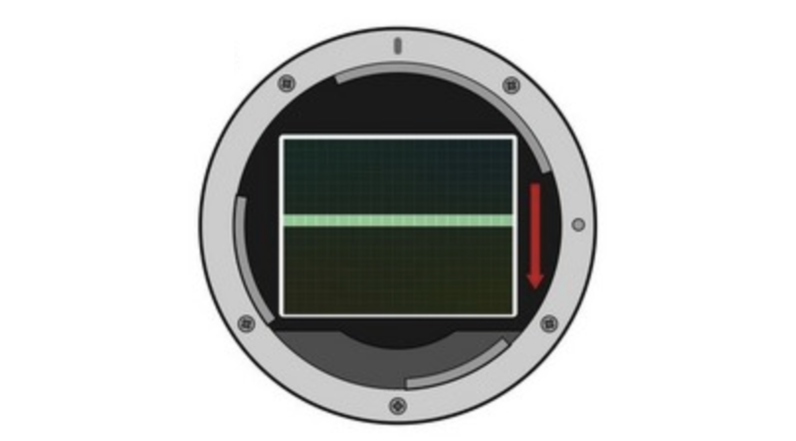
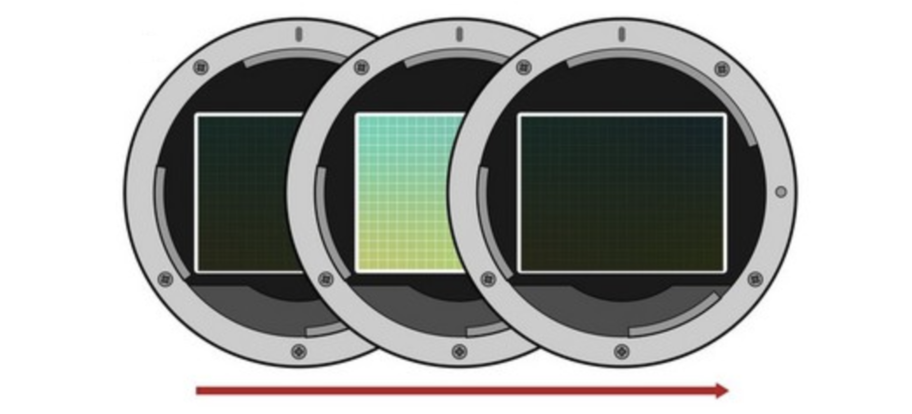

## 电子卷帘快门  (electronic rolling shutter)

电子卷帘快门是一种通过电子方式控制曝光的快门类型，常见于数码相机和智能手机中。其工作原理是逐行读取感光元件上的像素数据，而不是一次性读取整个图像。这意味着曝光是按行顺序进行的，从图像顶部逐行扫描到底部。
这种快门的主要特点是可以实现非常高的快门速度，因为没有机械运动部件。此外，电子卷帘快门可以在无声模式下工作，适合需要安静拍摄的场景。然而，由于逐行扫描的特性，快速移动的物体可能会出现变形或扭曲的现象，这被称为“卷帘快门效应”。尽管如此，电子卷帘快门在现代数码摄影中仍然非常普及，尤其是在需要高速度和低噪音的情况下。

-   **特点**：使用<u>电子模拟的前后帘</u>控制曝光

## 电子前帘快门 (electronic front shutter)

电子前帘快门是一种结合了电子和机械快门优点的快门技术。其工作原理是在曝光开始时使用电子方式逐行激活感光元件，从而取代传统机械快门的前帘动作。曝光结束时，机械快门的后帘则会关闭以结束曝光。
这种快门的主要特点是减少了机械前帘的移动，从而降低了相机的震动和噪音，提高了拍摄的稳定性和安静性。此外，电子前帘快门还能实现更快的响应时间和更高的快门速度，适合快速连续拍摄。不过，由于电子前帘快门依然依赖机械后帘，因此在某些极端拍摄条件下，可能会出现轻微的曝光不均匀现象。但总体来说，它在提高拍摄效率和图像质量方面有显著优势。

-   **特点**：使用<u>电子模拟的前帘</u>+使用<u>机械结构的后帘</u>控制曝光

## 全域电子快门 (electronic global shutter)

全域电子快门是一种先进的快门技术，通过电子方式同时激活感光元件上的所有像素，从而实现瞬间曝光。与传统的电子卷帘快门不同，全域电子快门不会逐行扫描，而是一次性读取整个图像数据。
这种快门的主要特点是能够消除“卷帘快门效应”，即快速移动的物体不会出现变形或扭曲现象。这使得全域电子快门特别适合拍摄高速运动的物体或在需要高精度曝光的场景中使用。此外，由于没有机械部件的移动，全域电子快门可以实现完全无声的拍摄，并且减少了机械磨损，提高了相机的耐用性和可靠性。总体来说，全域电子快门在速度、精度和安静性方面具有显著优势，广泛应用于高端数码相机和专业摄影设备中。

-   **特点**：<u>没有前后帘</u>全传感器同时开始曝光，同时结束曝光

