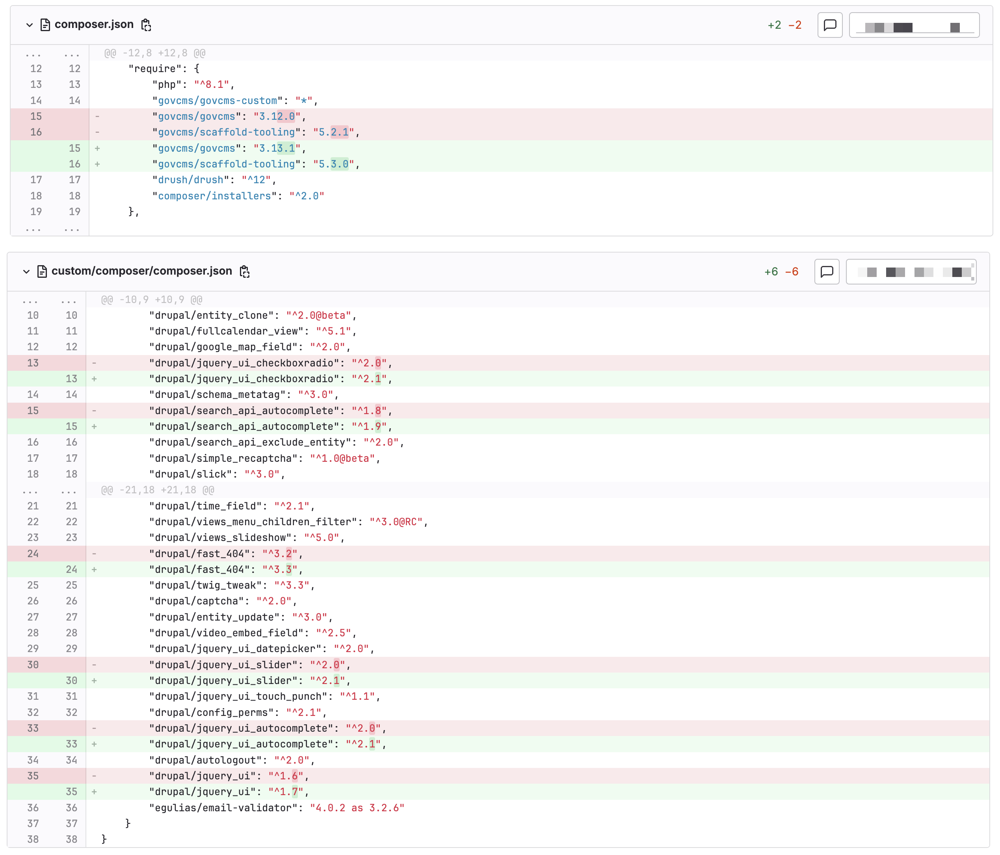

## How to update the GovCMS scaffold?

To keep your scaffold up to date,  changes to the GovCMS scaffold must be merged with your site's master branch via a merge request. This requires development effort to ensure your site remains up to date.

When a new version of the Scaffold is released, developers should merge a copy of the new scaffold with their site, noting any differences, testing, confirming, fixing conflicts and then merging as required.

An example of this process would be:

1.  Clone down the latest scaffold from https://github.com/govCMS/scaffold into a new folder
2.  Initialise the new scaffold project: ahoy init <project name> paas 10
3.  Run pygmy up and ahoy up
4.  Run a diff tool to compare the newly initialised project with your existing PaaS site.  An example of a diff tool would be Meld, however other tools are available
5.  Review relevant files and folders. Where it makes sense, include the changes into your existing project files
6.  Once completed, push these changes up to a feature branch to ensure that everything is working before merging it into your master branch

\* **Note:** As each PaaS site is different, and each release is different, we can not provide a specific list of what files need updating, this is something a developer who is maintaining the site must undertake.

## Example

## Reference

- [GovCMS Knowledge Archive - Keeping your GovCMS Scaffold up to date - PaaS Customers](https://www.govcms.support/support/solutions/articles/51000177893-keeping-your-govcms-scaffold-up-to-date-paas-customers)