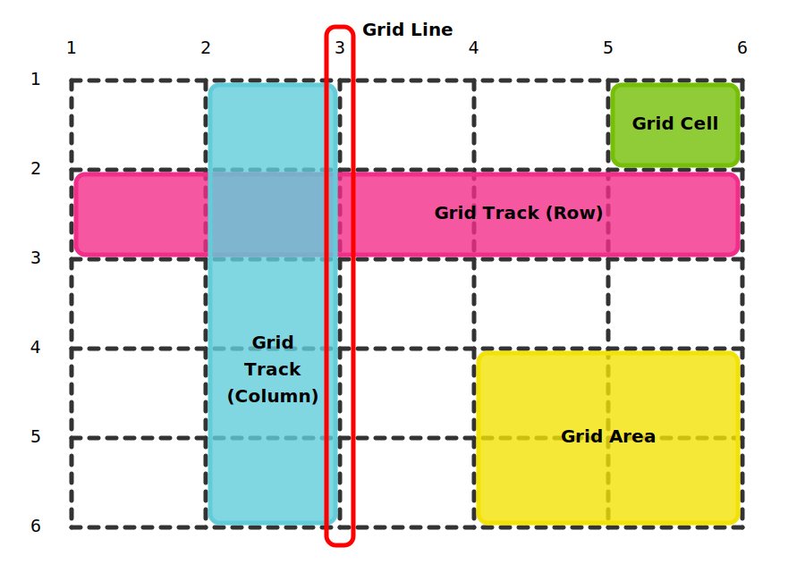
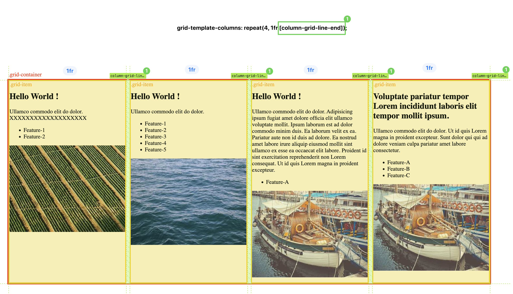
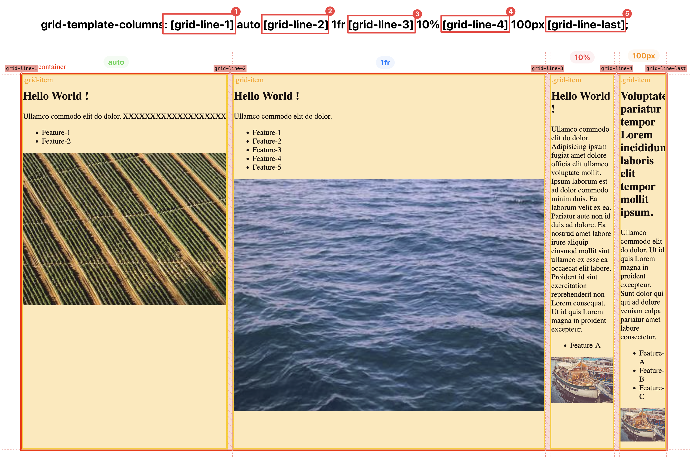
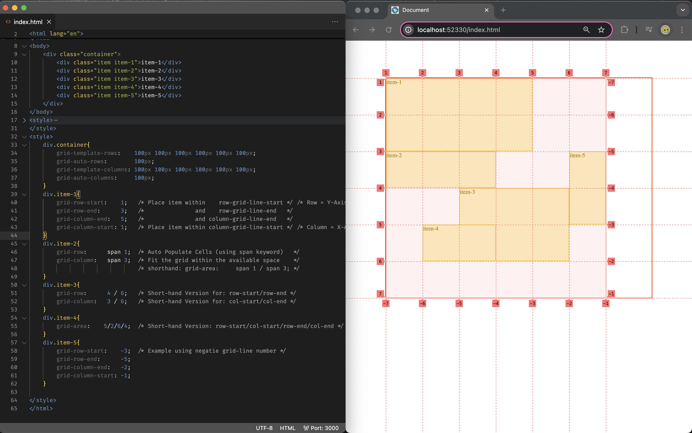
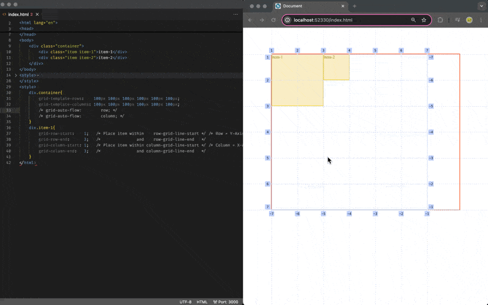
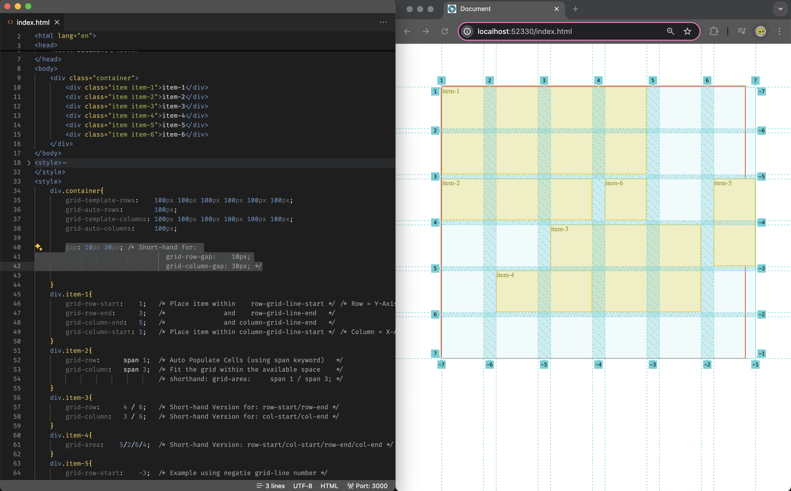
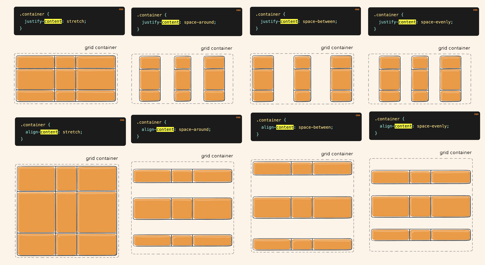
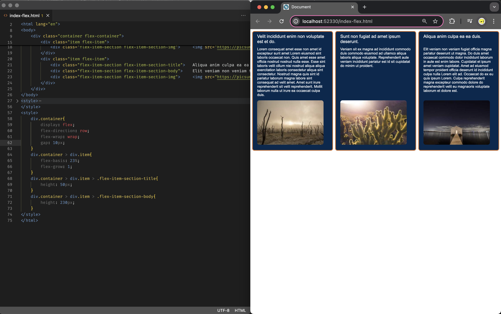
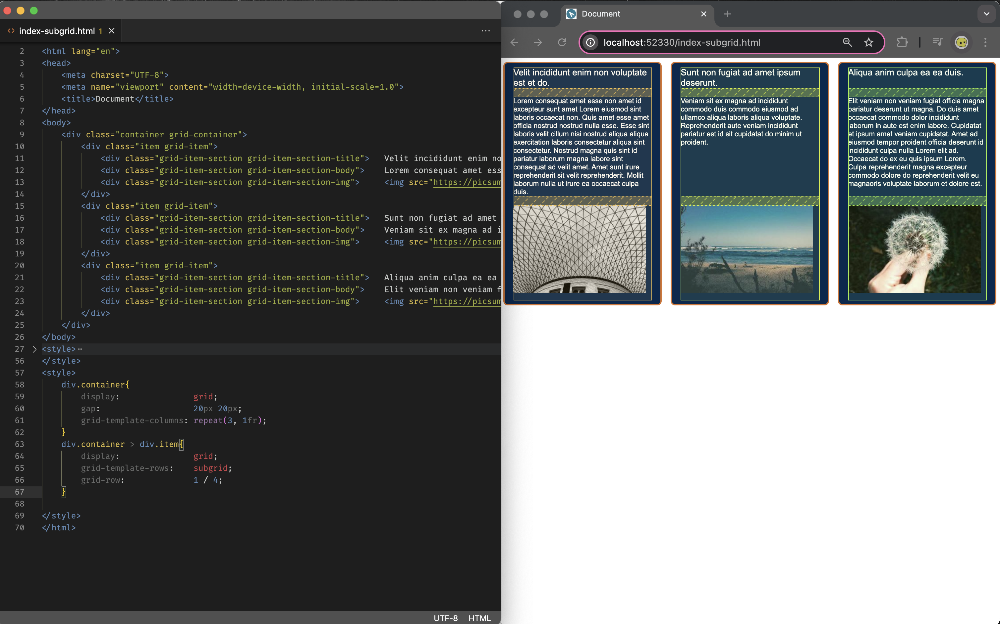

>   **Disclaimer**: This post is primarily written as a personal reference note and is not intended as professional or formal content. Much of the material has been directly copied from various sources for my own learning purposes. The language used is casual and unpolished. This is essentially my digital notebook - use at your own discretion. All credit goes to the original sources referenced below.

## Intuition

The concept of CSS Grid gained prominence during discussions about its sub-grid functionality, which enables precise alignment of elements within multiple uniform components. Upon investigating the principles of grid layout and comparing it to Flexbox, [Codedamn's article](https://codedamn.com/news/frontend/difference-between-flexbox-and-css-grid) highlights several advantages of implementing Grid over Flexbox:

-   **Dimensionality**: Two-dimensional, both rows and columns *(vs One-dimensional)*
-   **Layout Basis**: Structure-driven *(vs Content-driven)*
-   **Alignment**: Aligns items along both axes *(Aligns items along a single axis)*
-   **Complexity**: Better for complex layouts *(Simpler for straightforward layouts)*
-   **Responsiveness:** Supports dynamic grid resizing *(Adapts content flexibly to space)*
-   **Overlapping Items**: Allows overlapping elements *(Requires hacks for overlapping)*

Until now, I have mostly been a flex-only person in my day-to-day job. I think it might be time for me to finally take a bit on this hard bone, so I can potentially make it part of my daily coding.

---

## Terminologies 

Below is a image that contains the majority of the terminologies above for illustration purpose (illustration from [webkit.org](https://webkit.org/blog/7434/css-grid-layout-a-new-layout-module-for-the-web/), explainations from [mdn web docs](https://developer.mozilla.org/en-US/docs/Web/CSS/CSS_grid_layout/Basic_concepts_of_grid_layout) and [css-tricks](https://css-tricks.com/snippets/css/complete-guide-grid/)): 



### Grid Container & Grid Items (parent/child)

-   **MDN**: We create a *grid container* by declaring `display: grid` or `display: inline-grid` on an element. As soon as we do this, all *direct children* of that element become grid items.
-   **CSS-TRICK**: The element on which `display: grid` is applied. It’s the direct parent of all the grid items. In this example `container` is the grid container.The children (i.e. *direct* descendants) of the grid container. Here the `item` elements are grid items, but `sub-item` isn’t.

### Grid Track (row/column)

-   **MDN**: We define rows and columns on our grid with the `grid-template-rows` and `grid-template-columns` properties. These define grid tracks. A grid track is the space between any two adjacent lines on the grid.
-   **CSS-TRICK**: The space between two adjacent grid lines. You can think of them as the columns or rows of the grid. Here’s the grid track between the second and third-row grid lines.

### Grid Line

-   **MDN**: It should be noted that when we define a grid we define the grid tracks, not the lines. Grid then gives us numbered lines to use when positioning items.
-   **CSS-TRICK**: The dividing lines that make up the structure of the grid. They can be either vertical (“column grid lines”) or horizontal (“row grid lines”) and reside on either side of a row or column. Here the yellow line is an example of a column grid line.

### Grid Cells

-   **MDN**: A grid cell is the smallest unit on a grid. Conceptually it is like a table cell. 

    

### CSS-TRICK

-   The space between two adjacent row and two adjacent column grid lines. It’s a single “unit” of the grid. Here’s the grid cell between row grid lines 1 and 2, and column grid lines 2 and 3.

### Grid Area

-   **MDN**: Items can span one or more cells both by row or by column, and this creates a grid area.
-   **CSS-TRICK**: The total space surrounded by four grid lines. A grid area may be composed of any number of grid cells. Here’s the grid area between row grid lines 1 and 3, and column grid lines 1 and 3.

### Gutter

-   Gutters or alleys between grid cells can be created using the `column-gap` and `row-gap` properties, or the shorthand `gap`.


---

## Basic Usage 

### Grid Container Template

As a entry-level example, you can simply have a contrainer with multiple items inside, declare the container as a grid container via `display:grid` and its template column grid tracks via `grid-template-column` property, and in the property, you may give nave for the grid lines on ease-side of the track (so that you won't have to use number, but string formatted name instead). 

Blow are some of the examples, you can use play around using this file as the starting point: [example-grid-template-column.html](example-grid-template-column.html)






### Grid Auto-Wrapping / Responsive

You may want grid layout to automatically pick the number of columns for you based on the available space horizontally to achieve a responsive design for varies devices, this can be achieved via a combination of `auto-fill` and `minmax(a,b)` function All without using media query to define different `grid-template-column` for each breakpoint (original file: [example-autofit-minmax.html](example-autofit-minmax.html)): 

```css
grid-template-columns: repeat(auto-fill, minmax(500px, 1fr));
```


 *(p.s. historically, there was a weakness here is that first value in `minmax()` (the 10rem value above). If the container is narrower than whatever that minimum is, elements in that single column will overflow. If you encounter this situation via `grid-template-columns: repeat(auto-fill, minmax(min(10rem, 100%), 1fr));`. (Ref: https://css-tricks.com/intrinsically-responsive-css-grid-with-minmax-and-min/)*

### Grid Item Placement (Manual)

You can place grid-item with its container by defining its start/end grid-line using one of the following css attributes: 

-   full declaration version: 
    -   **Row (= Y-Axis)**: `grid-row-start`, `grid-row-end`
    -   **Column (= X-Axis)**: `grid-column-start`, `grid-column-end`
-   shorthand version: 
    -   two attributes: `grid-column: col-start/col-end` , `grid-row: row-start/row-end`
    -   one attribute: `grid-area: row-start/col-start/row-end/col-end`

Note that:

-   you may use `span` keyword to declare the number of cells you would want a grid item to occupy, if you do that then the grid will automatically place the item within the next available space that can fit the item; For example `grid-area: span 2/span 3` is declaring that item having 2 
-   *you may use `positive`/ `negative indexes` for the start/end grid-line-number, or use the `grid-line name` you declared in the template; For example `grid-column-template: [hello] 100px [world] ...` then you can declare an grid column for a item using `grid-column: hello / world`)* 

-   you may place/cover/layer one grid-item on another, and control who's on top/bottom using the `z-index` css attribute (please see `item-3` and `item-4` in the below screenshot)

Please find the example of usage below: 



(the original file can be found at: [example-grid-item-placement.html](example-grid-item-placement.html))


### Grid Item Placement (Auto-Flow)

By default if you do not specify the placement of the item, it will occupy 1 cell of a grid area on the next available row/horizontal/x-axis space, and you may change the behavior via the `grid-auto-flow:column/row` css attribute on the grid-container: 




### Grid Gutter (Gap)

You may define the spacing between each grid cells via one of the following: `column-gap`, `row-gap`, `gap`: 




### Grid Container Area

You may define the grid area template in the grid container, and place grid items on a area basis: 


(file can be found: [example-grid-area.html](example-grid-area.html)


### Grid Justify & Align

*(\*p.s.* 

-   ***Justify**: horizontal direction along the x-axis (or inline/row direction)*

- ***Align**: vertical direction along the y-axis (or block/column direction)*

#### Justify & Align of the Items within Grid 


```
.container           { justify-items: start/end/center/strech }
.container           {  align-items:  start/end/center/strech } 
.container > .item-x { justify-self:  start/end/center/strech } 
.container > .item-y {   align-self:  start/end/center/strech } 
```

#### Justify & Align of Grid Container's Columns/Rows




(Preety much like the flex `justify-content/align-items`

```
.container{ justify-content: start | end | center | stretch | space-around | space-between | space-evenly;  
.container{   align-content: start | end | center | stretch | space-around | space-between | space-evenly;  
```

---

## Sub-Grid Layout 

In flexbox layouts, developers frequently encounter scenarios where multiple elements (such as cards) are arranged horizontally within a single flex container. To maintain vertical alignment between corresponding content sections across these elements, this is typically achieved by setting either the `height` (or `min-height`) property.



However, with this setup you will need to roughly know the height of each item's section; If the actual height goes beyound the set value, for instance due to the narrow screen on mobile, it faces the potential of overflow. Although you may be able to mitigate it with text clamping (see below), setting a fixed height disregard of the content can be hard to achieve in the flex layout.  

```
overflow: hidden;
text-overflow: ellipsis;
display: -webkit-box;
-webkit-line-clamp: 3; /* for Webkit-based browsers like Chrome and Safari */
-webkit-box-orient: vertical;
```

With the introduction of the subgrid feature, we can achieve equivalent alignment control in CSS Grid layouts, basically you are using **grid of the container** as the **grid for item's sub-grid**, and using `auto` mitigate problem where the height issue mentioned earlier, it will automatically expand/collapse to fit the content height (this is very well explain on slaying the dragon's video: https://youtu.be/Yl8hg2FG20Q?t=576)



(you can find the comparison files at: 

-   [align-item-section-flex.html](align-item-section-flex.html)
-   [align-item-section-subgrid.html](align-item-section-subgrid.html)


---

## Reference
**CSS Grid Basics** 

- [CSS-TRICKS - CSS Grid Layout Guide](https://css-tricks.com/snippets/css/complete-guide-grid/#aa-properties-for-the-childrengrid-items)
- [CSS-TRICKS - CSS Grid Layout PDF CheatSheet](https://css-tricks.com/wp-content/uploads/2022/02/css-grid-poster.png)
- [Mdn web docs - Basic concepts of grid layout](https://developer.mozilla.org/en-US/docs/Web/CSS/CSS_grid_layout/Basic_concepts_of_grid_layout)
- [Slaying The Dragon - Learn CSS Grid - A 13 Minute Deep Dive](https://www.youtube.com/watch?v=EiNiSFIPIQE)

**Extended Knowledge** 

- [Codedamn - CSS Grid vs Flex](https://codedamn.com/news/frontend/difference-between-flexbox-and-css-grid)
- [Intrinsically Responsive CSS Grid with minmax() and min()](https://css-tricks.com/intrinsically-responsive-css-grid-with-minmax-and-min/) (maybe deprecated and may no longer apply)

-   [Learn CSS Subgrid in 14 minutes - Slaying The Dragon](https://www.youtube.com/watch?v=Yl8hg2FG20Q) 

-   [Easy and more consistent layouts using subgrid- Kevin Powell](https://www.youtube.com/watch?v=IIQa9f0REtM&t=164s)
