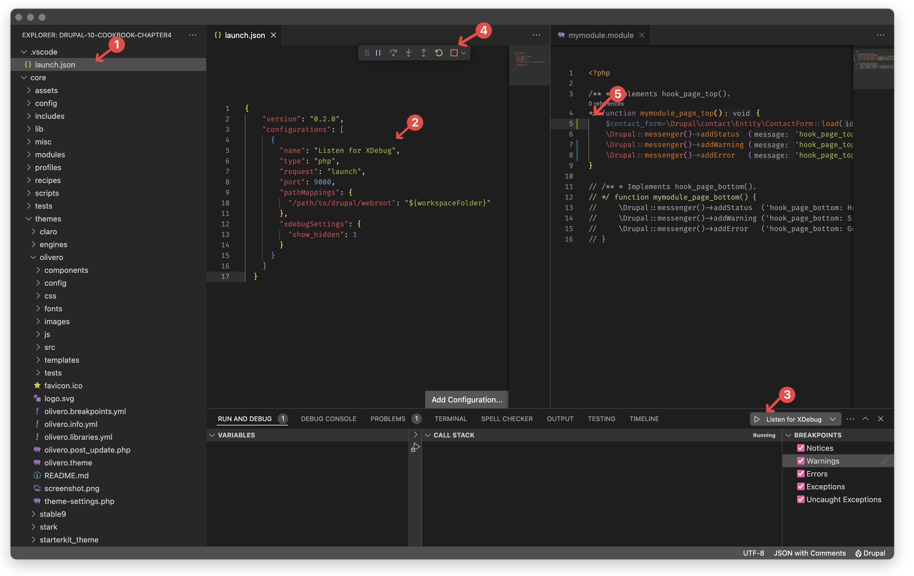

## 1 - Configurae MAMP 

To begin with you will need to configure your `php.ini` file, here different resource I found online claims that you should edit at different localtion, for your reference, the version that worked for me is to edit it directly in **MAMP’s PHP Configuration Panel** clicking on the **Open Template…** button will take me to the edit panel of `php.ini` file for the current running instance of the php. 

(In case it didn’t work for you, you may also try editing both ``/Applications/MAMP/conf/php[version]/php.ini`` and ``/Applications/MAMP/bin/php/php[version]/conf/php.ini``)

For all of the `php.ini` file mentioned, you will need to add the following: 

```
;[MAMP_Xdebug_MAMPzend_extension] is usally already configuraed
;[xdebug.output_dir] is also usually already configured

xdebug.mode=debug               ;for Xdebug v3.x.x;
xdebug.start_with_request=yes   ;for Xdebug v3.x.x;
xdebug.remote_enable = 1        ;for Xdebug v2.x.x;
xdebug.remote_autostart = 1     ;for Xdebug v2.x.x;
xdebug.remote_port=9000         ;for Xdebug v2.x.x;
xdebug.client_host=127.0.0.1
xdebug.client_port=9000      
xdebug.idekey = VSCODE
```


## 2 - Configure VS Code

### Method-1: by using php debug module to listen to xdebug ports


1. Search for “PHP Debug“ in market place 
2. Install the “PHP Debug“ extension
3. Run the “Listen for XDebug“ command (alternatively you can run it with VS Code command pallet as “Debug (PHP): Start Listening for debug“)
4. You should see a debug popup toolbox
5. Add some few breakpoint
6. Visit the drupal page as normal, and if the page triggers the breakpoint it will pause and you will be able to see the details relating to the executing scope in the “Run adn Debug“ panel, including the stored varaible in the current stack.  

### Method-2: create your launch.js and listen xdebug port

(only if the above method didn't work for you)



1. Create an empty `.vscode` if doesn’t exsit and an empty  `launch.js` file in it
2. Enter your `Listen for XDebug` php command in the `.vscode/launch.js`
3. Go to the VS Code’s “Run and Debug” panel (usually located at the bottom), and run the command you just created
4. You should see a debug popup tool box if the previous step successes
5. Add debug breakpoint in your code, and trigger the debugger with the `?XDEBUG_SESSION_START=idekey` tailing query parameter after your normal url.


## 3 - Start Debugging 

For now since I haven't used XDebug to debug my code a lot, I really don't have much to say in this section, I'll come back and revisit it if I have something to show-off (・ω・)b. 


## 4 - Demonstrative Video

[demo-video](<2025-01-09T160120 - Compress2 - 720P - 30frame.mp4>)


## Reference 

- Mac Enable Xdebug in MAMP: [https://joshbuchea.com/mac-enable-xdebug-in-mamp/](https://joshbuchea.com/mac-enable-xdebug-in-mamp/)
- Xdebug debugger: [https://www.drupal.org/docs/develop/development-tools/xdebug-debugger](https://www.drupal.org/docs/develop/development-tools/xdebug-debugger)
- Xdebug debugger - VSCode: [https://www.drupal.org/docs/develop/development-tools/configuring-visual-studio-code#s-configuring-xdebug](https://www.drupal.org/docs/develop/development-tools/configuring-visual-studio-code#s-configuring-xdebug)
- PHP Debug Adapter for Visual Studio Code: [https://marketplace.visualstudio.com/items?itemName=xdebug.php-debug](https://marketplace.visualstudio.com/items?itemName=xdebug.php-debug)